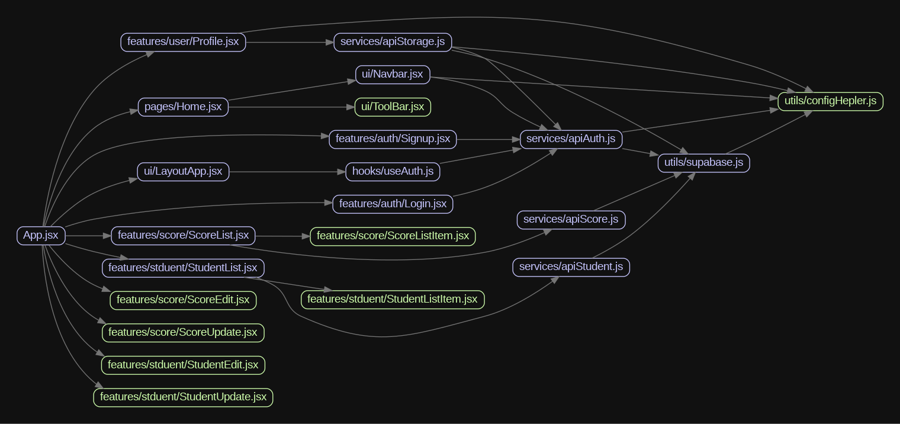

My Learn full stack of practice project

Todo:

1. to typescript from javascript
2. use Auth0 for authentication
3. use nodejs build backend server

## frontend

## bug

1. Teacher view: Create student could use same email
